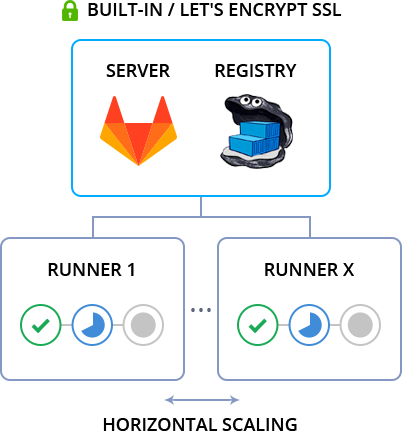
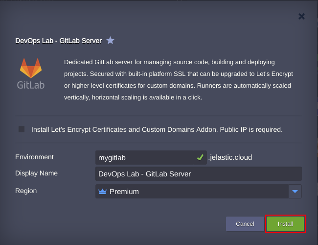
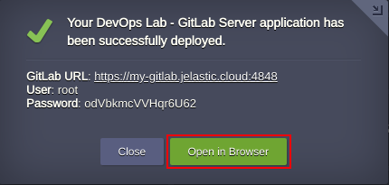

 

# DevOps Lab with GitLab Server

Dedicated GitLab server for managing source code, building and deploying projects. Secured with built-in platform SSL that can be upgraded to Let's Encrypt or higher level certificates for custom domains. Runners are automatically scaled vertically, horizontal scaling is available in a click.

 

Automation scripts inside the package perform the following actions:
- Creates 2 system containers with pre-installed Docker Engine CE and docker-compose utility
- Generates and installs self-signed or [Let’s Encrypt SSL certificates](https://jelastic.com/blog/free-ssl-certificates-with-lets-encrypt/), as well as shares them with Runners via NFS volume 
- Injects dynamic environment variables such as tokens, passwords and environment domain
- Deploys GitLab Server and Container Registry via [docker-compose.yml](https://github.com/jelastic/docker-gitlab/blob/master/docker-compose.yml) in one Docker Engine node 
- Creates one Runner in a separate Docker Engine and registers it automatically in GitLab Server
- Automates discovery of newly added Runners upon horizontal scaling  

### Deployment to the Cloud

Click the Deploy button below, specify your email address within the widget, choose one of the [Jelastic Public Cloud providers](https://jelastic.com/install-application/?manifest=https://raw.githubusercontent.com/jelastic-jps/gitlab/master/manifest.jps) and press Install.

**Note:** If you are already registered at Jelastic, you can deploy this cluster by importing the [package manifest raw link](https://github.com/jelastic-jps/gitlab/blob/master/manifest.jps) within the dashboard.

### Installation Process

In the opened confirmation window at Jelastic dashboard, set an *Environment* name and, optionally, customize its *Display Name*. Then, select the preferable region (if several are available). 

By default, Jelastic will issue a platform built-in SSL certificate for your application, but you have an option to get a [Let’s Encrypt](https://letsencrypt.org/) for your custom domain if required. Then press **Install**.

 

Afterward, make sure that application is up and running by pressing **Open in Browser** button. 

 

Use credentials from the successful installation message or received email notification to log in to admin panel. 
   
### Managed Hosting Business

To start offering this solution to your customers please follow to [Managed PaaS Hosting Business](https://jelastic.com/apaas/)
